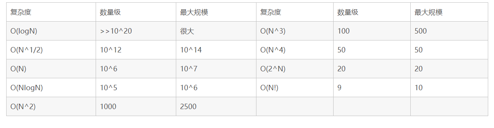

## 数量级与时间复杂度



一般leetcode给出的超时限制是1s,上面给出的应该是1s内各个复杂度可以处理的数量级。比如，当n是10^4数量级时，可以接受O(nlogn）、O(n)等复杂度的算法。O(n^2)的算法就可能会超时了

## 1. 排序

 ### 1.1 快速排序

快速排序：针对解决第k个最大或者最小的问题

```
var swap = function(arr,L,R){
    let temp = arr[L];
    arr[L] = arr[R];
    arr[R] = temp;
}
// partition负责将arr(L:R)中按照pivot分为三部分 小于pivot pivot 大于pivot
// 实现一次快排
var partition = function(arr,L,R){
    let pivotIndex = L,pivot=arr[pivotIndex];
    while(L<R){
    	// 注意：这里先检查右边，再检查左边
        while(L<R && arr[R]>=pivot){
            R--;
        }
        while(L<R && arr[L]<=pivot){
            L++;
        }
        swap(arr,L,R);
    }
    swap(arr,L,pivotIndex);
    return L;
}
// 递归排序
var quick = function(arr,L,R){
    if(L>R){
        return ;
    }
    let pivotIndex = partition(arr,L,R);
    quick(arr,L,pivotIndex-1);
    quick(arr,pivotIndex+1,R);
}
// 启动排序
var QuickSort = function(arr){
    quick(arr,0,arr.length-1);
    return arr;
}
```

对于前k个最小的问题：如果不要求前k个最小值的顺序，则直接找到第k个最小的值所在的索引，返回arr.slice(0,k)即可；如果要求前k个最小值的顺序，则在找到第k个最小的值所在的索引后，就只搜寻(L,k-1)范围内即可

```
var swap = function(arr,L,R){
    let temp = arr[L];
    arr[L] = arr[R];
    arr[R] = temp;
}
// partition负责将arr(L:R)中按照pivot分为三部分 小于pivot pivot 大于pivot
// 实现一次快排
var partition = function(arr,L,R){
    let pivotIndex = L,pivot=arr[pivotIndex];
    while(L<R){
        while(L<R && arr[R]>=pivot){
            R--;
        }
        while(L<R && arr[L]<=pivot){
            L++;
        }
        swap(arr,L,R);
    }
    swap(arr,L,pivotIndex);
    return L;
}
// 递归排序
var quick = function(arr,L,R){
    if(L>R){
        return ;
    }
    let pivotIndex = partition(arr,L,R);
    if(pivotIndex===k){
    	quick(arr,L,pivotIndex-1);
    }else{
    	quick(arr,L,pivotIndex-1);
    	quick(arr,pivotIndex+1,R);
    }
}
// 启动排序
var QuickSort = function(arr){
    quick(arr,0,arr.length-1);
    return arr;
}
```

## 2 动态规划

#### [剑指 Offer 42. 连续子数组的最大和](https://leetcode-cn.com/problems/lian-xu-zi-shu-zu-de-zui-da-he-lcof/)

**示例1:**

```
输入: nums = [-2,1,-3,4,-1,2,1,-5,4]
输出: 6
解释: 连续子数组 [4,-1,2,1] 的和最大，为 6。

要求时间复杂度：O(n)

思路：观测之前的结果对当前和有无贡献，如果有，则a=a+nums[i],没有则a=nums[i]
	max负责记录最大值
```

```
/**
 * @param {number[]} nums
 * @return {number}
 */
var maxSubArray = function(nums) {
    // 动态规划
    var a = nums[0]>0 ? nums[0] :0,max=nums[0];
    for(let i=1;i<nums.length;i++){
        // a  只选择a  之前+a
        a = nums[i]>a+nums[i] ? nums[i] : a+nums[i];
        // max  之前的最大值  a
        max = max>a ? max : a; 
    }
    return max;
};
```

#### [剑指 Offer 47. 礼物的最大价值](https://leetcode-cn.com/problems/li-wu-de-zui-da-jie-zhi-lcof/)

在一个 m*n 的棋盘的每一格都放有一个礼物，每个礼物都有一定的价值（价值大于 0）。你可以从棋盘的**左上角**开始拿格子里的礼物，并每次向右或者向下移动一格、直到到达棋盘的**右下角**。给定一个棋盘及其上面的礼物的价值，请计算你最多能拿到多少价值的礼物？   中等难度

```
var maxValue = function(grid) {
    let m=grid.length,n=grid[0].length;
    let dp = Array.from(Array(m),()=>Array(n).fill(0));
    dp[0][0] = grid[0][0];
    for(let i=1;i<m;i++){dp[i][0] = dp[i-1][0] + grid[i][0];}
    for(let j=1;j<n;j++){dp[0][j] = dp[0][j-1] + grid[0][j];}
    for(let i=1;i<m;i++){
        for(let j=1;j<n;j++){
            //  上   左
            dp[i][j] = Math.max(dp[i-1][j],dp[i][j-1])+grid[i][j];
        }
    }
    return dp[m-1][n-1];
};
```

#### [剑指 Offer 49. 丑数](https://leetcode-cn.com/problems/chou-shu-lcof/)

我们把只包含质因子 2、3 和 5 的数称作丑数（Ugly Number）。求按从小到大的顺序的第 n 个丑数。1, 2, 3, 4, 5, 6, 8, 9, 10, 12 是前 10 个丑数。

dp[i]表示第i+1个丑数。某个丑数一定是因子2 3 5乘一个小丑数产生的。记录前三个分别乘以2 3 5小于当前丑数的小丑数们，则新的丑数就是这三个小丑数乘以2 3 5得到的较小的那个

```
var nthUglyNumber = function(n) {
    if(n<=0){return -1}
    let dp = Array(n).fill(0);
    dp[0] = 1;
    let id2=0,id3=0,id5=0;
    for(let i=1;i<n;i++){
    	// 第i+1个丑数就是：大于前一个数的最小的丑数
        dp[i] = Math.min(dp[id2] * 2, Math.min(dp[id3] *3, dp[id5] * 5));
        if(dp[i] === dp[id2]*2){
            id2++;
        }
        if(dp[i] === dp[id3]*3){
            id3++;
        }
        if(dp[i] === dp[id5]*5){
            id5++;
        }
    }
    console.log(dp)
    return dp[n-1]
};
```

#### [剑指 Offer 60. n个骰子的点数](https://leetcode-cn.com/problems/nge-tou-zi-de-dian-shu-lcof/)

难度中等245

把n个骰子扔在地上，所有骰子朝上一面的点数之和为s。输入n，打印出s的所有可能的值出现的概率。

你需要用一个浮点数数组返回答案，其中第 i 个元素代表这 n 个骰子所能掷出的点数集合中第 i 小的那个的概率。

示例 1:

输入: 1
输出: [0.16667,0.16667,0.16667,0.16667,0.16667,0.16667]
示例 2:

输入: 2
输出: [0.02778,0.05556,0.08333,0.11111,0.13889,0.16667,0.13889,0.11111,0.08333,0.05556,0.02778]

分析：

1个骰子，得到的结果：1~6

2个骰子，得到的结果：2~12     n~n*6

`dp[i][j]`表示i个骰子得到和为j的概率，则可以推出：

`dp[3][3] = dp[1][1]*dp[2][2] + dp[1][2]*dp[2][1] + dp[1][3]*dp[2][0];`

```
 var dicesProbability = function(n) {
    let dp = Array.from(Array(n+1),()=>Array(6*n+1).fill(0));
    // 初始化，一个骰子掷出1~6的概率均为1/6，2个及以上骰子掷出0或者1的概率为0
    for(let i=1;i<7;i++){
        dp[1][i] = 1/6.0;
    }    
    // 从 至少两个骰子掷出2开始
    for(let i=2;i<n+1;i++){
        // i个骰子
        for(let j=i;j<6*i+1;j++){
            // 骰出几 
            for(let k=1;k<7;k++){
                if(i-k>=0 && j-k>=0){
                    // i个骰子和为j  1个骰子为k  i-1个骰子和为j-k
                    dp[i][j] += dp[1][k]*dp[i-1][j-k];
                }
            }
        }
    }
    // 记录所有结果的值
    let result = Array(5*n+1).fill(0);
    let index = 0;
    // n个骰子得到的结果范围： n~6*n
    for(let i=n;i<6*n+1;i++){
        result[index++] = dp[n][i];
    }
    return result;
};
```

#### [343. 整数拆分](https://leetcode-cn.com/problems/integer-break/)

难度中等527

给定一个正整数 *n*，将其拆分为**至少**两个正整数的和，并使这些整数的乘积最大化。 返回你可以获得的最大乘积。

**示例 1:**

```
输入: 2
输出: 1
解释: 2 = 1 + 1, 1 × 1 = 1。
```

分析：dp[i]表示整数i拆分为两个整数后得到的最大乘积  `

```
var integerBreak = function(n) {
    var dp = Array(n+1).fill(0);
    // console.log(dp)
    for(let i=2;i<n+1;i++){
        for(let k=1;k<i;k++){
            dp[i] = Math.max(dp[i],k*dp[i-k],k*(i-k));
        }
    }
    return dp[n];
};
```

## 3 dfs

#### [剑指 Offer 46. 把数字翻译成字符串](https://leetcode-cn.com/problems/ba-shu-zi-fan-yi-cheng-zi-fu-chuan-lcof/)

难度中等

```
var translateNum = function (num) {
  var str = num.toString();
  var dfs = function (index) {
    if (index >= str.length-1) {
    //   console.log("path", path);
      return 1;
    }
    // 判断接下来的两个数字
    let temp = Number(str[index]+str[index+1]);
    if (temp < 26 && temp >= 10) {
    	// 符合条件，则分两步
        return dfs(index+1)+dfs(index+2);
    }else{
    	// 只能一步走
        return dfs(index+1);
    }
  };
  return dfs(0);
};
```

## 4 双指针

#### [剑指 Offer 48. 最长不含重复字符的子字符串](https://leetcode-cn.com/problems/zui-chang-bu-han-zhong-fu-zi-fu-de-zi-zi-fu-chuan-lcof/)

普通解法：

```
var lengthOfLongestSubstring = function (s) {
    var m = ''
    var res = 0
    for (var i = 0; i < s.length; i++) {
    	// 如果m中不存在s[i]，则将s[i]放入m中
        if (m.indexOf(s[i]) == -1) {
            m += s[i]
        } else {
        	// 如果m中已经存在s[i],则先记录res的长度，然后重新计算m,去除原来的s[i]及其之前的元素，产生包含新的s[i]的m
            res = res < m.length ? m.length : res  // 保存长度
            m += s[i]
            m = m.slice(m.indexOf(s[i]) + 1)
        }
    }
    res = res < m.length ? m.length : res
    return res || s.length
};
```

双指针解法：

```
var lengthOfLongestSubstring = function (s) {
  let res = 0,
    l = -1;
  let map = new Map();   // 保存不重复元素及其索引
  for (let r = 0; r < s.length; r++) {
  	// 如果s[r]已经存在了，则将l移动到不包含前一个s[r]的索引处，保证l,r之间的元素不重复
    if (map.has(s[r])) {
      l = Math.max(l, map.get(s[r]));
    }
    // 更新map中s[r]的索引
    map.set(s[r], r);
    // 保存l,r之间的元素的数目，最大值就是最大不重复子串的长度
    res = Math.max(r - l, res);
  }
  return res;
};
```

#### [剑指 Offer 57. 和为s的两个数字](https://leetcode-cn.com/problems/he-wei-sde-liang-ge-shu-zi-lcof/)

简单

输入一个**递增排序**的数组和一个数字s，在数组中查找两个数，使得它们的和正好是s。如果有多对数字的和等于s，则输出任意一对即可。

示例 1：

输入：nums = [2,7,11,15], target = 9
输出：[2,7] 或者 [7,2]

```
var twoSum = function(nums, target) {
    // 双指针
    let i=0,j=nums.length-1;
    while(i<j){
        if(nums[i]+nums[j]>target){
            j--;
        }else if(nums[i]+nums[j]<target){
            i++;
        }else{
            return [nums[i],nums[j]];
        }
    }
};
```

## 5 二叉树

#### [剑指 Offer 54. 二叉搜索树的第k大节点](https://leetcode-cn.com/problems/er-cha-sou-suo-shu-de-di-kda-jie-dian-lcof/)

分析：二叉搜索树，即中序遍历为增序排列

中序遍历：左 根 右

则右 根 左就是降序排列，得到降序排列的第k个即可

```
var kthLargest = function(root, k) {
    // 方法2：堆排序
    // 方法1：中序遍历，得到第k个
    let count = 0,res=null;
    var traverse = function(root){
        if(root===null){return ;}
        traverse(root.right);
        count++;
        if(count===k){
            res = root.val;
            return ;
        }
        traverse(root.left);
    }
    traverse(root);
    return res;
};
```

## 6 位运算

这里涉及到js中的位运算符，位运算符只对整数起作用。js中所有数都是以64位浮点数的形式存储，但是做位运算时，会先将数值转化为32位带符号的整数，位运算的结果也是一个32位带符号的整数。

小数转为带符号整数：直接将小数位去除，只取整数位

将数值num转换为32位带符号整数：`num=num | 0;`,无论num是整数还是小数

第32位是符号位，所以有符号整数的范围是：-2^31 ~ 2^31-1

```
1|0    1
-1|0   -1
Math.pow(2,32)|1   0  // 2^32 是二进制位的第33位，溢出，直接被截断
(Math.pow(2,32)+1)|1   1      
(Math.pow(2,32)-1)|1   -1
```

左移运算符：`<<`,尾部补0，最高位的符号位一起移动，左移i位相当于 `num*(2^i)`

右移运算符：>>,正数头部补0，负数头部补1，最高位参与移动，左移i位相当于 `Math.floor(num/(2^i))`。

无符号右移：`>>>`,头部一律补0，不考虑符号位，此运算总是得到正值。

比较常用的数值位运算操作：

```
n&(n-1)  去除n的二进制位中最低的那一位1
n&(-n)   得到n的二进制位中最低的那一位1
& 与    &=
| 或    |=
^ 异或  ^=
! 非   
```

#### [136. 只出现一次的数字](https://leetcode-cn.com/problems/single-number/)

给定一个**非空**整数数组，除了某个元素只出现一次以外，其余每个元素均出现两次。找出那个只出现了一次的元素。

简单

分析：异或：同为0，不同为1

相同的两个数各个位上均相同，则其异或的结果为1；所以将nums中所有的数均异或一遍，结果就相当于两个只出现一次的数a,b异或的结果

```
var singleNumber = function(nums) {
    return nums.reduce((a,b)=>a^b);
};
```

#### [260. 只出现一次的数字 III](https://leetcode-cn.com/problems/single-number-iii/)

#### [剑指 Offer 56 - I. 数组中数字出现的次数](https://leetcode-cn.com/problems/shu-zu-zhong-shu-zi-chu-xian-de-ci-shu-lcof/)

中等

首先得到diff的最低位的1，diff1 = diff & -diff; 该位为1则表示：a,b在这一位的值是不同的。至于其它出现两次的num,则他们在这一位的值肯定是相同的，相异或的结果是0，所以就只会剩下a或者b

 diff1只有1位为0，其余位均为1，则通过求diff1&num即可将所有的num分为两组，每一组的结果相异或即可得到一个数，两组的结果合并即是所求

例如:1,2,3,4,2,1

diff = 1^2^3^4^2^1 = 3^4 = 0110

diff1 = 0010

1&diff1=0   2&diff1=1  3&diff1=1 4&diff1=0

所以num被分为了两组：1 4 1  和  2 3 2   两组分别异或的结果是4 和  3

```
var singleNumber = function(nums) {
    var diff = nums.reduce((a,b)=>{
        return a^b;
    })
    diff = diff & -diff;
    let res = [0,0];
    for(let i=0;i<nums.length;i++){
        if(diff&nums[i]){
            res[0] ^= nums[i];
        }else{
            res[1] ^= nums[i];
        }
    }
    return res;
};
```

#### [137. 只出现一次的数字 II](https://leetcode-cn.com/problems/single-number-ii/)

给你一个**整数数组** `nums` ，除某个元素仅出现 **一次** 外，其余每个元素都恰出现 **三次 。**请你找出并返回那个只出现了一次的元素。

中等

js中整数都是以32位二进制位存储的，统计每一位上所有num的数值(1或者0)的和，最后除以3取余，然后每一位的和加起来即可得到最终的结果

```
var singleNumber = function(nums) {
    let res = 0;
    for(let i=0;i<32;i++){
        let count = 0;
        for(let num of nums){
            count += (num>>>i)&1;
        }
        // console.log(count)
        if(count%3){
            res |= 1<<i;
        }
    }
    return res;
};
```

## 7 滑动窗口：

#### [剑指 Offer 57 - II. 和为s的连续正数序列](https://leetcode-cn.com/problems/he-wei-sde-lian-xu-zheng-shu-xu-lie-lcof/)

输入一个正整数 target ，输出所有和为 target 的连续正整数序列（至少含有两个数）。

序列内的数字由小到大排列，不同序列按照首个数字从小到大排列。

示例 1：

输入：target = 9
输出：[[2,3,4],[4,5]]

思路：左开右闭滑动窗口，两个指针控制滑动窗口的大小，如果滑动窗口中的数值和小于target,则数值和加上nums[j],j右移；如果大于target则和减去nums[i],i左移。如果等于，则保存结果，并且数值和减去nums[i],加上nums[j],i、j分别右移一位

```
var findContinuousSequence = function(target) {
    let arr = [];
    for(let i=0;i<target;i++){arr[i]=i+1;}
    let sum = 0;
    let res = [];
    let i=0,j=0;
    while(i<arr.length/2){
        if(sum<target){
            sum+=arr[j];
            j++;
        }else if(sum>target){
            sum-=arr[i];
            i++;
        }else{
            res.push(arr.slice(i,j));
            sum += arr[j];
            sum -= arr[i];
            i++;
            j++;
        }
    }
    return res;
};
```

## 8 队列

#### [剑指 Offer 59 - II. 队列的最大值](https://leetcode-cn.com/problems/dui-lie-de-zui-da-zhi-lcof/)

请定义一个队列并实现函数 max_value 得到队列里的最大值，要求函数max_value、push_back 和 pop_front 的均摊时间复杂度都是O(1)。

若队列为空，pop_front 和 max_value 需要返回 -1

输入: 
["MaxQueue","push_back","push_back","max_value","pop_front","max_value"]
[[],[1],[2],[],[],[]]
输出: [null,null,null,2,1,2]

```
var MaxQueue = function() {
    this.queue = [];
    this.maxQueue = [];
};

/**
 * @return {number}
 */
MaxQueue.prototype.max_value = function() {
    // maxQueue的队头元素一定是当前queue中的最大元素
    return this.queue.length ? this.maxQueue[0] : -1;
};

/** 
 * @param {number} value
 * @return {void}
 */
MaxQueue.prototype.push_back = function(value) {
    // 去除比当前值小的最大值，保证队头元素是当前queue中最大的元素
    while(value>this.maxQueue[this.maxQueue.length-1]){
        this.maxQueue.pop();
    }
    this.queue.push(value);
    // 将当前值放入最大值队列中
    this.maxQueue.push(value);
};

/**
 * @return {number}
 */
MaxQueue.prototype.pop_front = function() {
    if (this.queue.length === 0) {
        return -1;
    }
    let temp = this.queue.shift();
    if (this.maxQueue[0] === temp) {
        this.maxQueue.shift();
    }
    return temp;
};
```

## 9 map

#### [剑指 Offer 61. 扑克牌中的顺子](https://leetcode-cn.com/problems/bu-ke-pai-zhong-de-shun-zi-lcof/)

难度简单

从扑克牌中随机抽5张牌，判断是不是一个顺子，即这5张牌是不是连续的。2～10为数字本身，A为1，J为11，Q为12，K为13，而大、小王为 0 ，大小王可以看成任意数字（即0可以看成是任何数字）。A 不能视为 14。

**示例 1:**

输入: [1,2,3,4,5]
输出: True

分析：分析可知数字的范围为：【0,13】

1. 没有大小王的情况：顺子一定存在max-min<=4
2. 存在大小王，但不将0考虑进去：
   1. 则顺子一定存在max-min<4
   2. 另外，排除一种情况：[1,13]中存在重复数值，则一定不能构成顺子

```
var isStraight = function(nums) {
    var map = new Map();
    let max = Number.MIN_SAFE_INTEGER,min=Number.MAX_SAFE_INTEGER;
    for(let i=0;i<nums.length;i++){
        // 遇到0，即大小王，则不算
        if(nums[i]===0){continue;}
        // 如果[1,13]中某个元素已经统计过，则必定不能构成重复元素
        if(map.has(nums[i])){return false;}
        map.set(nums[i],1);
        // 计算最大值和最小值
        max = Math.max(max,nums[i]);
        min = Math.min(min,nums[i]);
    }
    // 最大值和最大小值差值小于等于4则说明可以连成顺子
    return max-min<=4;
};
```

## 10 数组

#### [剑指 Offer 62. 圆圈中最后剩下的数字](https://leetcode-cn.com/problems/yuan-quan-zhong-zui-hou-sheng-xia-de-shu-zi-lcof/)

难度简单

0,1,···,n-1这n个数字排成一个圆圈，从数字0开始，每次从这个圆圈里删除第m个数字（删除后从下一个数字开始计数）。求出这个圆圈里剩下的最后一个数字。

例如，0、1、2、3、4这5个数字组成一个圆圈，从数字0开始每次删除第3个数字，则删除的前4个数字依次是2、0、4、1，因此最后剩下的数字是3。

**示例 1：**

输入: n = 5, m = 3
输出: 3

**限制:**

- `1 <= n <= 10^5`
- `1 <= m <= 10^6`

分析：

1. 第一个删除的索引是idx=(m-1%n),因为索引从0开始。
2. 删除第一个数后，数组元素个数变成n-1,而idx处的后一位元素又会补位，所以第二位删除的元素索引就变成了(idx+m-1)%(n-1)
3. 所以被删除元素的索引就是：idx = （idx+m-1)%(n--)
4. 另外，这个题目需要注意：参数的数量级问题。以上思路的解题时间复杂度为O(n^2),则时间复杂度达到了10^10，在leetcode中使用了9260ms，接近1秒。**好像超出1s就超时了？？？**

```
var lastRemaining = function(n, m) {
    // 假定第一个删除的数字的索引是idx,则第二个删除的索引应该是(idx+m-1)%(n-1)
    let arr =Array(n);
    for(let i=0;i<n;i++){
        arr[i] = i;
    }
    let idx = 0;
    while(n>1){
        idx = (idx+m-1)%(n--);
        arr.splice(idx,1);
    }
    // console.log(arr)
    return arr[0];
};
```

